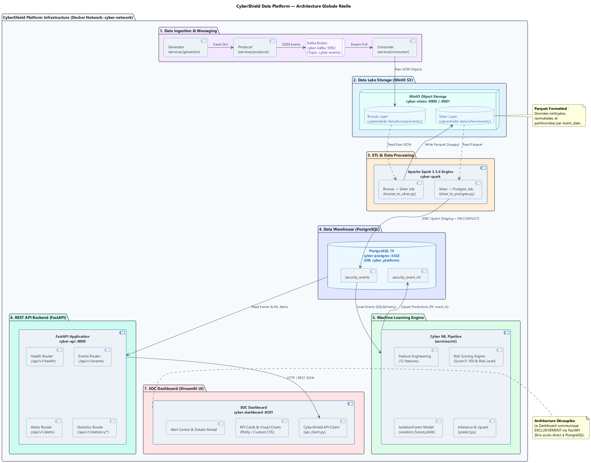
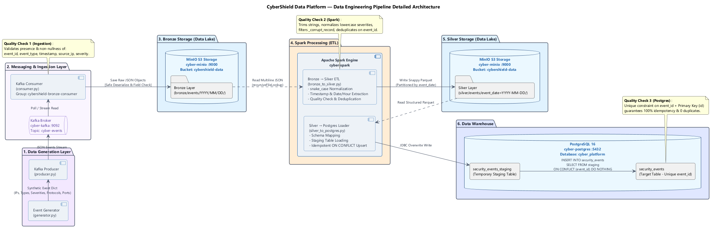
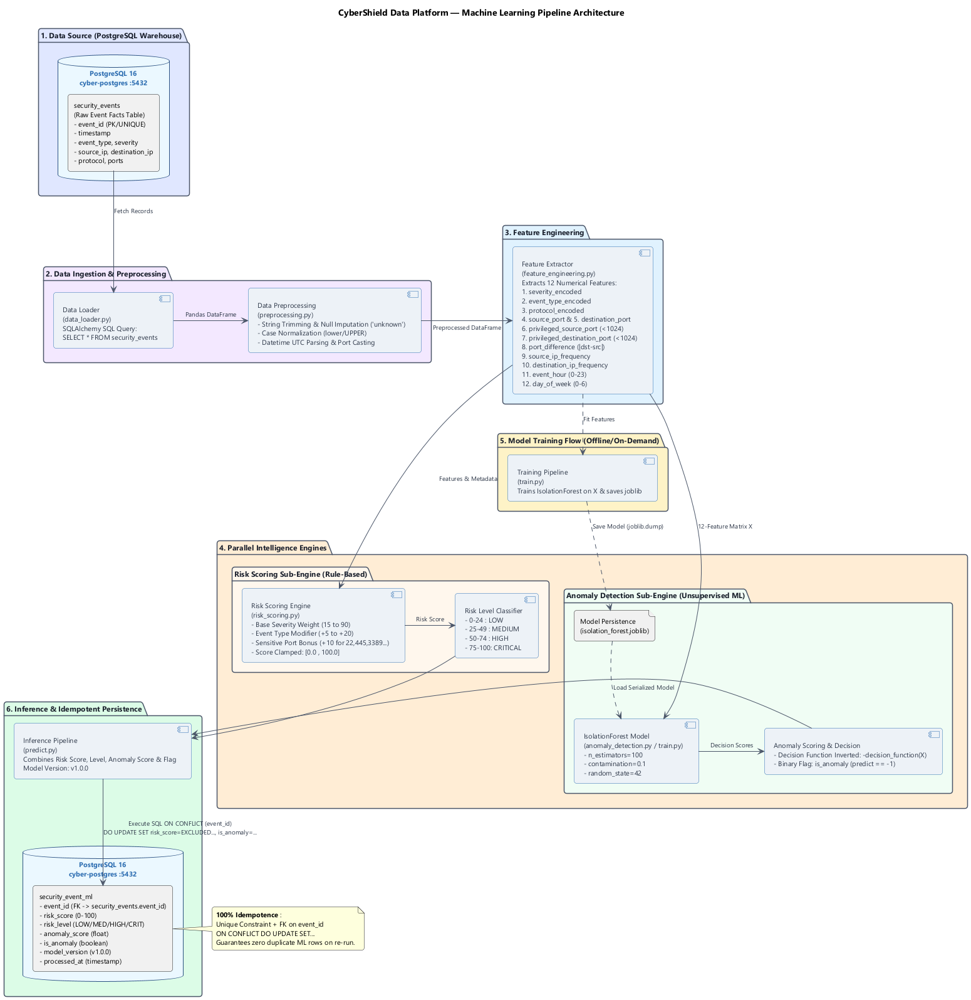
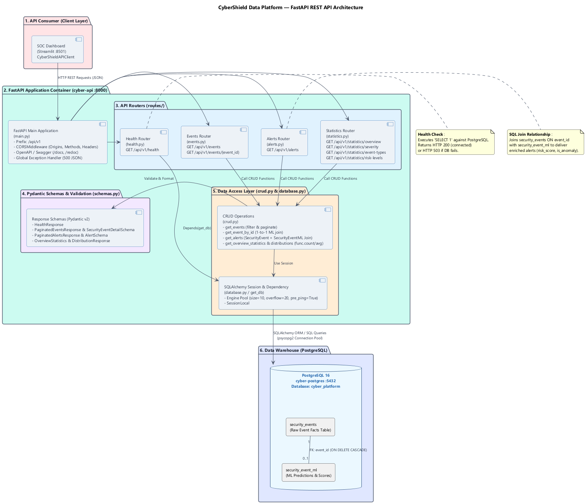
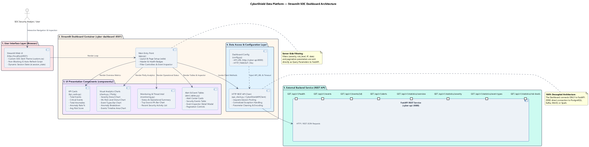

# CyberShield Data Platform

[](https://www.python.org/)
[](https://kafka.apache.org/)
[](https://spark.apache.org/)
[](https://min.io/)
[](https://www.postgresql.org/)
[](https://fastapi.tiangolo.com/)
[](https://streamlit.io/)
[](https://scikit-learn.org/)
[](https://www.docker.com/)

An **end-to-end, defensive cybersecurity data platform** engineered for real-time security log ingestion, Lakehouse data processing, Machine Learning threat scoring, anomaly detection, and Security Operations Center (SOC) visual monitoring.

---

## 1. Overview

**CyberShield Data Platform** demonstrates a complete, enterprise-grade Data Engineering and Machine Learning architecture tailored for defensive cybersecurity operations. The platform ingests synthetic security log telemetry (e.g., port scans, brute force attacks, malware detections), streams events through Apache Kafka, stores unstructured raw data in a MinIO S3 Data Lake (Bronze Layer), processes and cleans data using Apache Spark into Parquet format (Silver Layer), loads validated records into PostgreSQL, computes rule-based Risk Scores and applies an **unsupervised IsolationForest Machine Learning model** for anomaly detection, exposes the data via a high-performance FastAPI REST API, and renders real-time visual threat analytics on a Streamlit SOC Dashboard.

> **Academic / Portfolio Context**: This platform is engineered as a final engineering thesis (PFE) and portfolio project to demonstrate end-to-end integration across Data Engineering, Machine Learning, and Security Operations (SecOps).

---

## Table of Contents

- [1. Overview](#1-overview)
- [2. Key Features](#2-key-features)
- [3. Architecture](#3-architecture)
- [4. Data Engineering Pipeline](#4-data-engineering-pipeline)
- [5. Data Lake — Bronze & Silver](#5-data-lake--bronze--silver)
- [6. Machine Learning](#6-machine-learning)
- [7. REST API](#7-rest-api)
- [8. SOC Dashboard](#8-soc-dashboard)
- [9. Technology Stack](#9-technology-stack)
- [10. Project Structure](#10-project-structure)
- [11. Installation & Setup](#11-installation--setup)
- [12. Running the Platform](#12-running-the-platform)
- [13. Testing & Validation](#13-testing--validation)
- [14. End-to-End Results](#14-end-to-end-results)
- [15. API Endpoints](#15-api-endpoints)
- [16. Documentation & Diagrams](#16-documentation--diagrams)
- [17. Future Improvements](#17-future-improvements)
- [18. Author](#18-author)

---

## 2. Key Features

- **Real-Time Telemetry Streaming**: Event Generator producing structured cybersecurity event streams published to Apache Kafka (`cyber-events` topic).
- **Multi-Tier S3 Data Lake (Lakehouse Architecture)**:
  - **Bronze Layer**: Raw, immutable JSON objects stored in MinIO (`cybershield-data/bronze/events/`).
  - **Silver Layer**: Cleaned, normalized, Snappy-compressed Parquet files partitioned by `event_date` (`silver/events/`).
- **Distributed ETL with Apache Spark**: Scalable PySpark jobs for data cleaning, column normalization (`snake_case`), timestamp parsing, derived date/hour extraction, deduplication, and JDBC database staging.
- **Relational Data Warehousing**: PostgreSQL 16 storing structured fact events (`security_events`) and Machine Learning predictions (`security_event_ml`) linked via Foreign Keys.
- **Hybrid Machine Learning Engine**:
  - **Risk Scoring Engine**: Deterministic 0–100 risk score and level classification (`LOW`, `MEDIUM`, `HIGH`, `CRITICAL`).
  - **Anomaly Detection**: Unsupervised Scikit-Learn `IsolationForest` detecting anomalous telemetry patterns, persisted via `joblib`.
- **Decoupled REST API Middleware**: FastAPI application featuring Pydantic v2 validation, SQLAlchemy ORM connection pooling, server-side pagination, multi-column filtering, and OpenAPI (Swagger) documentation.
- **Enterprise SOC Dashboard**: Streamlit web interface with dark SOC theme, dynamic Plotly visual analytics, Alert Center, Security Event Inspector, and non-blocking JavaScript auto-refresh.
- **100% Idempotency & Data Quality**: Multi-tiered validation ensuring zero duplicate records across re-runs.

---

## 3. Architecture

The CyberShield Data Platform runs on Docker Compose across a dedicated bridge network (`cyber-network`) comprising 6 microservices:



```
Generator ──> Producer ──> Kafka (cyber-events) ──> Consumer ──> MinIO Bronze (JSON)
                                                                      │
                                                                 Spark ETL
                                                                      │
                                                                      ▼
PostgreSQL (security_event_ml) <── ML Engine <── PostgreSQL <── MinIO Silver (Parquet)
              │                                  (security_events)
              └───────────────┬────────────────────────┘
                              │
                              ▼
                        FastAPI (:8000)
                              │ HTTP / REST
                              ▼
                    SOC Dashboard (:8501)
```

---

## 4. Data Engineering Pipeline

The Data Engineering pipeline manages the end-to-end flow of event telemetry from generation to warehouse storage:



### Pipeline Stages
1. **Telemetry Generation**: `services/generator/generator.py` produces synthetic security events containing `event_id`, `timestamp`, `event_type`, `severity`, `source_ip`, `destination_ip`, `protocol`, `source_port`, and `destination_port`.
2. **Kafka Production**: `services/producer/producer.py` publishes events as JSON to the Kafka topic `cyber-events`.
3. **Ingestion & Bronze Storage**: `services/consumer/consumer.py` consumes messages from Kafka, validates mandatory fields (`event_id`, `event_type`, `timestamp`, `source_ip`, `severity`), and saves raw JSON files to MinIO Bronze.
4. **Spark Bronze-to-Silver ETL**: `services/processing/bronze_to_silver.py` reads JSON files, normalizes schema names to `snake_case`, trims whitespace, parses ISO timestamps, derives `event_date` and `event_hour`, filters corrupt records (`_corrupt_record`), deduplicates on `event_id`, and writes Snappy-compressed Parquet files to MinIO Silver.
5. **Spark Silver-to-PostgreSQL Loader**: `services/processing/silver_to_postgres.py` reads Silver Parquet files, writes to a temporary staging table (`security_events_staging`), and executes an idempotent SQL upsert:
   ```sql
   INSERT INTO security_events (event_id, event_type, severity, timestamp, event_date, event_hour, source_ip, destination_ip, protocol, source_port, destination_port, processed_at)
   SELECT event_id, event_type, severity, timestamp, event_date, event_hour, source_ip, destination_ip, protocol, source_port, destination_port, processed_at
   FROM security_events_staging
   ON CONFLICT (event_id) DO NOTHING;
   ```

---

## 5. Data Lake — Bronze & Silver

The platform uses **MinIO** as an S3-compatible Object Storage Data Lake with bucket `cybershield-data`:

| Layer | Path | Format | Description |
|---|---|---|---|
| **Bronze** | `bronze/events/YYYY/MM/DD/*.json` | JSON | Raw, immutable event payloads received directly from Kafka |
| **Silver** | `silver/events/event_date=YYYY-MM-DD/*.parquet` | Parquet (Snappy) | Cleaned, structured, schema-enforced columnar Parquet partitioned by date |

---

## 6. Machine Learning

The Machine Learning module processes security events to calculate threat risk scores and detect behavioral anomalies:



### Feature Engineering (12 Numerical Features)
The feature extraction pipeline (`services/ml/feature_engineering.py`) transforms raw log fields into 12 numerical features:
1. `severity_encoded` (low=1, medium=2, high=3, critical=4, unknown=0)
2. `event_type_encoded` (Categorical mapping 1–10 across attack types)
3. `protocol_encoded` (TCP=1, UDP=2, HTTP=3, HTTPS=4, DNS=5, UNKNOWN=0)
4. `source_port` (Integer port number)
5. `destination_port` (Integer port number)
6. `privileged_source_port` (Binary flag for ports < 1024)
7. `privileged_destination_port` (Binary flag for ports < 1024)
8. `port_difference` (Absolute difference `|destination_port - source_port|`)
9. `source_ip_frequency` (Frequency count of source IP occurrences)
10. `destination_ip_frequency` (Frequency count of destination IP occurrences)
11. `event_hour` (Hour of day 0–23)
12. `day_of_week` (Day of week 0–6)

### Risk Scoring Engine
Calculates a deterministic 0–100 Risk Score (`services/ml/risk_scoring.py`):
- **Base Severity Weight**: `low` (+15), `medium` (+35), `high` (+65), `critical` (+90).
- **Attack Vector Modifier**: `data_exfiltration` (+20), `malware_detected` (+15), `unauthorized_access` (+15), `brute_force`/`http_attack` (+10), `failed_login`/`dns_anomaly`/`port_scan` (+5).
- **Sensitive Port Bonus**: +10 for destination ports in `{22, 23, 445, 3389, 389, 1433, 3306, 5432}`.
- **Clamping**: Bounded between `0.0` and `100.0`.

**Risk Level Mapping**:
- `0.0` – `24.99`: **`LOW`**
- `25.0` – `49.99`: **`MEDIUM`**
- `50.0` – `74.99`: **`HIGH`**
- `75.0` – `100.0`: **`CRITICAL`**

### Anomaly Detection (Isolation Forest)
- **Algorithm**: `sklearn.ensemble.IsolationForest`
- **Parameters**: `n_estimators=100`, `contamination=0.1`, `random_state=42`, `n_jobs=-1`.
- **Inverted Decision Function**: `anomaly_score = -decision_function(X)` (higher values indicate greater anomaly likelihood).
- **Model Persistence**: Serialized using `joblib` to `services/ml/models/isolation_forest.joblib`.
- **Database Upsert**: `services/ml/predict.py` executes an idempotent SQL upsert into `security_event_ml` using `ON CONFLICT (event_id) DO UPDATE SET...`.

---

## 7. REST API

The backend REST API is built with **FastAPI** (`services/api/`) and serves as the data gateway for external consumers:



### Key Specifications
- **Framework**: FastAPI with Pydantic v2 validation schemas.
- **ORM & Database**: SQLAlchemy 2.0 with PostgreSQL connection pooling (`pool_size=10`, `max_overflow=20`, `pool_pre_ping=True`).
- **Interactive Documentation**: Available at `/docs` (Swagger UI) and `/redoc` (ReDoc).
- **Data Joins**: Joins `security_events` with `security_event_ml` on `event_id` for enriched alert views.
- **Global Error Handling**: Standardized JSON responses for 404, 422, 503, and 500 errors.

---

## 8. SOC Dashboard

The Security Operations Center (SOC) Dashboard is built with **Streamlit** (`services/dashboard/`):



### Features & Design
- **Strict Decoupling**: Communicates **exclusively via HTTP REST API** (`CyberShieldAPIClient`), with ZERO direct database access.
- **Visual Analytics**: Interactive Plotly charts (Events by Severity, ML Risk Distribution, Attack Vectors, Anomaly Breakdown, Velocity Timeline, Top Source IPs).
- **Alert Center**: Prioritized alert cards with filtering by Risk Level, Anomaly Status, and Risk Score threshold.
- **Security Events Inspector**: Dynamic event selection with full JSON payload & ML result inspection modal.
- **Monitoring Controls**: Non-blocking JavaScript auto-refresh (10s, 30s, 60s, OFF) with live API and Database health indicators.

---

## 9. Technology Stack

| Category | Technologies Used |
|---|---|
| **Infrastructure** | Docker, Docker Compose, Linux (WSL2 / Debian) |
| **Streaming & Messaging** | Apache Kafka 3.5 (Confluent Platform, KRaft mode) |
| **Data Lake Storage** | MinIO Object Storage (S3 API compatible) |
| **Data Processing & ETL** | Apache Spark 3.5.6, PySpark, Hadoop S3A, AWS SDK |
| **Data Warehouse** | PostgreSQL 16.15 (SQLAlchemy 2.0, psycopg2 driver) |
| **Machine Learning** | Python 3.11+, Scikit-Learn 1.4, Pandas, NumPy, Joblib |
| **Backend REST API** | FastAPI 0.110, Pydantic v2, Uvicorn |
| **SOC Dashboard** | Streamlit 1.32, Plotly, HTML5/CSS3 Custom Theme |
| **Testing** | Pytest, Python Unittest |
| **Documentation** | PlantUML 1.2024.7, Graphviz 2.44 |

---

## 10. Project Structure

```
CyberShield-Data-Platform/
├── .env                              # Environment configuration (secrets & ports)
├── .dockerignore                     # Docker build exclusion rules
├── .gitignore                        # Git version control exclusions
├── docker-compose.yml                # Multi-container service definition
├── requirements.txt                  # Python dependencies
├── docs/                             # Documentation & diagrams
│   ├── diagrams/                     # PlantUML source files (.puml)
│   │   ├── api/                      # api-architecture.puml
│   │   ├── architecture/             # global-architecture.puml
│   │   ├── dashboard/                # dashboard-architecture.puml
│   │   ├── data-engineering/         # data-pipeline.puml
│   │   └── machine-learning/         # ml-pipeline.puml
│   └── images/                       # Rendered PNG architecture diagrams
├── infrastructure/                   # Infrastructure configuration & Dockerfiles
│   ├── kafka/                        # Kafka KRaft setup
│   ├── minio/                        # MinIO Data Lake setup
│   ├── postgresql/                   # PostgreSQL schema & init scripts
│   └── spark/                        # Apache Spark & Hadoop S3A jars setup
├── services/                         # Core Python services
│   ├── api/                          # FastAPI REST Application
│   │   ├── main.py                   # FastAPI entry point & CORS
│   │   ├── config.py                 # API environment config
│   │   ├── database.py               # SQLAlchemy engine & session setup
│   │   ├── models.py                 # ORM models (SecurityEvent & SecurityEventML)
│   │   ├── schemas.py                # Pydantic v2 schemas
│   │   ├── crud.py                   # Database query functions
│   │   └── routes/                   # Endpoint routers (health, events, alerts, statistics)
│   ├── consumer/                     # Kafka to MinIO Consumer
│   ├── dashboard/                    # Streamlit SOC Dashboard
│   │   ├── app.py                    # Streamlit main entry point
│   │   ├── api_client.py             # CyberShieldAPIClient HTTP REST client
│   │   ├── components/               # UI components (KPIs, Charts, Tables, Monitoring)
│   │   └── styles/                   # Enterprise dark theme custom CSS
│   ├── generator/                    # Synthetic event telemetry generator
│   ├── ml/                           # Machine Learning Module
│   │   ├── data_loader.py            # Loads PG events into Pandas
│   │   ├── preprocessing.py          # Cleaning & normalization
│   │   ├── feature_engineering.py    # 12 numerical features extractor
│   │   ├── risk_scoring.py           # Deterministic Risk Scoring engine
│   │   ├── anomaly_detection.py      # IsolationForest model wrapper
│   │   ├── train.py                  # Model training pipeline
│   │   ├── predict.py                # Inference & PG upsert pipeline
│   │   └── models/                   # Persisted joblib models
│   ├── processing/                   # PySpark ETL scripts
│   │   ├── bronze_to_silver.py       # Spark Bronze (JSON) -> Silver (Parquet)
│   │   └── silver_to_postgres.py     # Spark Silver (Parquet) -> PostgreSQL Loader
│   └── producer/                     # Kafka Event Producer
└── tests/                            # Automated test suites
    ├── test_api.py                   # E2E FastAPI REST tests (15 tests)
    ├── test_kafka_to_bronze.py       # E2E Kafka to MinIO tests (8 tests)
    └── test_ml_pipeline.py           # E2E Machine Learning tests (15 tests)
```

---

## 11. Installation & Setup

### Prerequisites
- **Docker Desktop** (with Docker Compose v2+)
- **Python 3.11+**
- **Git**

### Step 1: Clone Repository
```bash
git clone https://github.com/GJHamza/CyberShield-Data-Platform.git
cd CyberShield-Data-Platform
```

### Step 2: Environment Configuration
Create a `.env` file at the project root (loaded automatically by Docker Compose and Python services):
```env
POSTGRES_DB=cyber_platform
POSTGRES_USER=cyber_admin
POSTGRES_PASSWORD=CyberShield2026
POSTGRES_PORT=5432

MINIO_ROOT_USER=cybershield_admin
MINIO_ROOT_PASSWORD=CyberShieldMinio2026
MINIO_API_PORT=9000
MINIO_CONSOLE_PORT=9001
MINIO_ENDPOINT=localhost:9000
MINIO_BUCKET=cybershield-data

KAFKA_BOOTSTRAP_SERVERS=localhost:9092
KAFKA_TOPIC=cyber-events

API_URL=http://localhost:8000
```

### Step 3: Local Python Virtual Environment Setup
```bash
python -m venv .venv
# On Windows PowerShell:
.\.venv\Scripts\Activate.ps1
# On Linux/macOS:
source .venv/bin/activate

pip install -r requirements.txt
```

---

## 12. Running the Platform

### 1. Launch Containerized Infrastructure
Start all 6 microservices via Docker Compose:
```bash
docker compose up -d
```

Verify service status:
```bash
docker compose ps
```
*Expected output*: `cyber-postgres` (healthy), `cyber-kafka` (Up), `cyber-minio` (Up), `cyber-spark` (Up), `cyber-api` (Up), `cyber-dashboard` (healthy).

### 2. Produce & Ingest Telemetry
Generate 20 cybersecurity events and stream them to Kafka:
```bash
python -c "from services.producer.producer import main; main(max_events=20, interval_seconds=0.1)"
```

Consume events from Kafka into MinIO Bronze Layer:
```bash
python -c "from services.consumer.consumer import main; main(max_messages=20)"
```

### 3. Run Spark ETL Pipeline
Execute Spark Bronze-to-Silver transformation (JSON to Parquet):
```bash
docker exec cyber-spark /opt/spark/bin/spark-submit --conf spark.hadoop.fs.s3a.access.key=cybershield_admin --conf spark.hadoop.fs.s3a.secret.key=CyberShieldMinio2026 /opt/spark/work-dir/services/processing/bronze_to_silver.py
```

Execute Spark Silver-to-PostgreSQL Loader:
```bash
docker exec cyber-spark /opt/spark/bin/spark-submit --conf spark.hadoop.fs.s3a.access.key=cybershield_admin --conf spark.hadoop.fs.s3a.secret.key=CyberShieldMinio2026 /opt/spark/work-dir/services/processing/silver_to_postgres.py
```

### 4. Run Machine Learning Pipeline
Execute ML Inference (Risk Scoring + IsolationForest Anomaly Detection):
```bash
python services/ml/predict.py
```

*(Optional)* Re-train the IsolationForest model:
```bash
python services/ml/train.py
```

### 5. Access Portals & Interfaces
- **FastAPI REST API**: [http://localhost:8000](http://localhost:8000)
- **FastAPI Swagger Documentation**: [http://localhost:8000/docs](http://localhost:8000/docs)
- **Streamlit SOC Dashboard**: [http://localhost:8501](http://localhost:8501)
- **MinIO Console**: [http://localhost:9001](http://localhost:9001)

---

## 13. Testing & Validation

The platform includes automated end-to-end test suites covering all architectural layers:

```bash
# 1. Test FastAPI REST Backend (15 E2E Tests)
python tests/test_api.py

# 2. Test Machine Learning Pipeline & Database Upsert (15 E2E Tests)
python tests/test_ml_pipeline.py

# 3. Test Kafka Production & MinIO Ingestion (8 E2E Tests)
python tests/test_kafka_to_bronze.py
```

---

## 14. End-to-End Results

The platform has undergone full live validation with zero data loss or duplicate records:

### End-to-End Validation Metrics
| Metric Layer | Initial State | Live Test Addition | Final Validated State |
|---|:---:|:---:|:---:|
| **Kafka Events Stream** | 81 events | +20 events | **121 events** |
| **MinIO Bronze Layer (JSON)** | 81 objects | +20 objects | **121 JSON files** |
| **MinIO Silver Layer (Parquet)** | 61 rows | +40 rows | **101 Parquet rows** |
| **PostgreSQL `security_events`** | 61 rows | +40 rows | **101 records** |
| **PostgreSQL `security_event_ml`** | 61 rows | +40 rows | **101 ML predictions** |
| **Duplicate Records** | 0 | 0 | **0 (100% Idempotent)** |

### Live API Analytics Output (`GET /api/v1/statistics/overview`)
- **Total Security Events**: `101`
- **Total ML Anomalies Detected**: `13`
- **Anomaly Detection Rate**: `12.87%`
- **Critical Risk Events**: `49`
- **High Risk Events**: `20`
- **Medium Risk Events**: `26`
- **Low Risk Events**: `6`
- **Average Risk Score**: `66.39 / 100`

---

## 15. API Endpoints

FastAPI exposes 8 REST endpoints under `/api/v1`:

| Endpoint | Method | Parameters | Description |
|---|:---:|---|---|
| `/` | `GET` | None | Root welcome endpoint and system information |
| `/api/v1/health` | `GET` | None | Health check endpoint testing PostgreSQL connectivity |
| `/api/v1/events` | `GET` | `page`, `page_size`, `severity`, `event_type`, `source_ip`, `protocol`, `event_date` | Retrieve paginated security events with multi-column filtering |
| `/api/v1/events/{event_id}` | `GET` | `event_id` | Retrieve single security event detail with 1-to-1 joined ML results |
| `/api/v1/alerts` | `GET` | `page`, `page_size`, `risk_level`, `is_anomaly`, `min_risk_score` | Retrieve paginated security alerts & ML anomalies |
| `/api/v1/statistics/overview` | `GET` | None | Aggregated SOC metrics (total events, anomalies, risk score distribution) |
| `/api/v1/statistics/severity` | `GET` | None | Severity distribution breakdown (`critical`, `high`, `medium`, `low`) |
| `/api/v1/statistics/event-types` | `GET` | None | Event types and attack vectors distribution |
| `/api/v1/statistics/risk-levels` | `GET` | None | ML Risk level distribution breakdown |

---

## 16. Documentation & Diagrams

All architecture diagrams are documented in PlantUML (`docs/diagrams/`) and rendered as PNG images (`docs/images/`):

| Diagram Title | PlantUML Source | Rendered PNG Image |
|---|---|---|
| **Global Architecture** | [`global-architecture.puml`](docs/diagrams/architecture/global-architecture.puml) | [View PNG](docs/images/global-architecture.png) |
| **Data Engineering Pipeline** | [`data-pipeline.puml`](docs/diagrams/data-engineering/data-pipeline.puml) | [View PNG](docs/images/data-pipeline.png) |
| **Machine Learning Pipeline** | [`ml-pipeline.puml`](docs/diagrams/machine-learning/ml-pipeline.puml) | [View PNG](docs/images/ml-pipeline.png) |
| **REST API Architecture** | [`api-architecture.puml`](docs/diagrams/api/api-architecture.puml) | [View PNG](docs/images/api-architecture.png) |
| **SOC Dashboard Architecture** | [`dashboard-architecture.puml`](docs/diagrams/dashboard/dashboard-architecture.puml) | [View PNG](docs/images/dashboard-architecture.png) |

---

## 17. Future Improvements

- **Workflow Orchestration**: Integrate Apache Airflow or Prefect to schedule periodic Spark ETL and ML retraining jobs.
- **Enhanced Security & Authentication**: Implement JWT OAuth2 authentication and Role-Based Access Control (RBAC) for FastAPI and Streamlit.
- **Real-Time Streaming Analytics**: Expand Spark Structured Streaming directly from Kafka to Delta Lake for sub-second latency analytics.
- **Enterprise Observability**: Integrate Prometheus and Grafana for system metrics monitoring (Kafka lag, Spark executor memory, PostgreSQL query latency).
- **CI/CD & Cloud Deployment**: GitHub Actions pipeline for automated testing and Kubernetes (Helm / K8s) deployment configuration.

---

## 18. Author

**Hamza Gourja**  
Data Science Engineering Student @ SUPMTI  
*CyberShield Data Platform — Final Year Engineering Thesis (PFE)*
